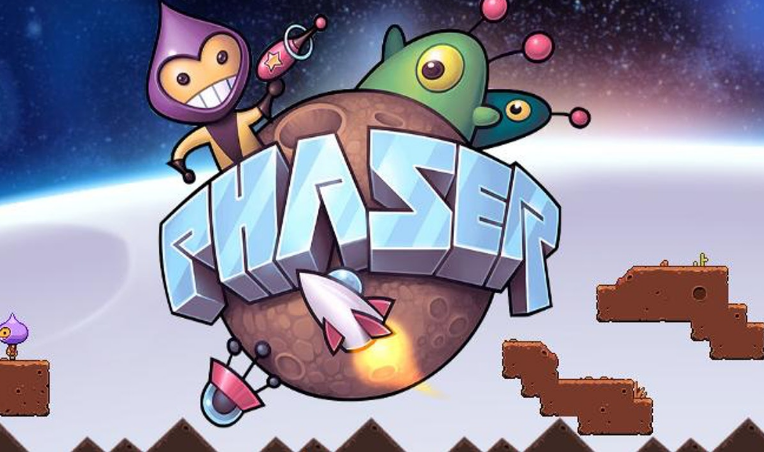
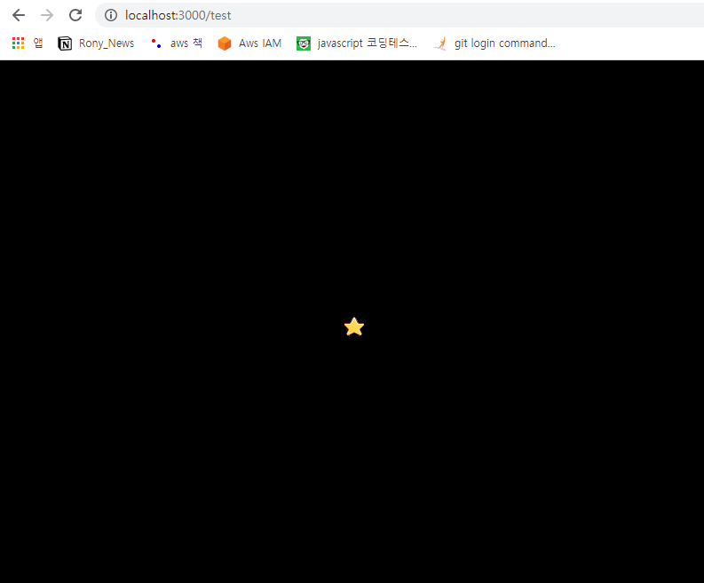
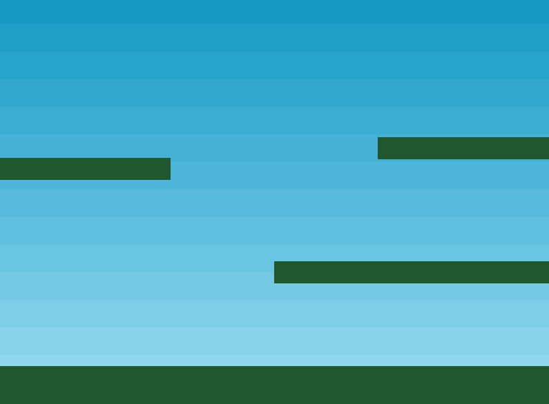
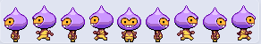
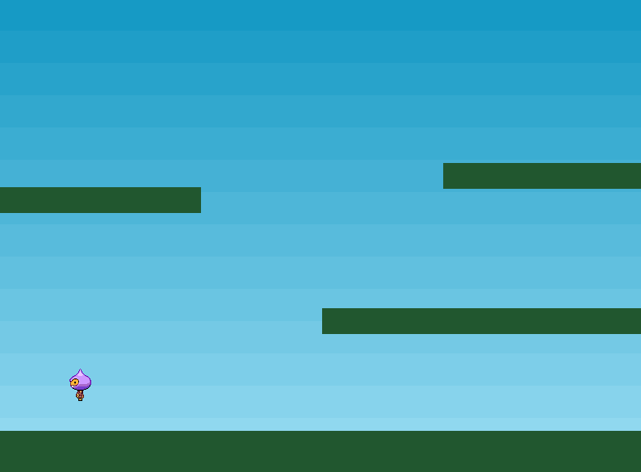
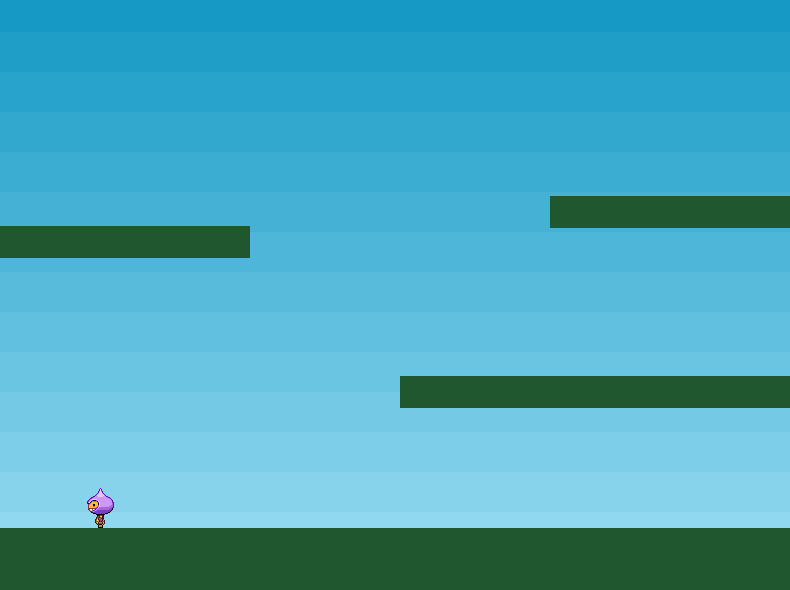
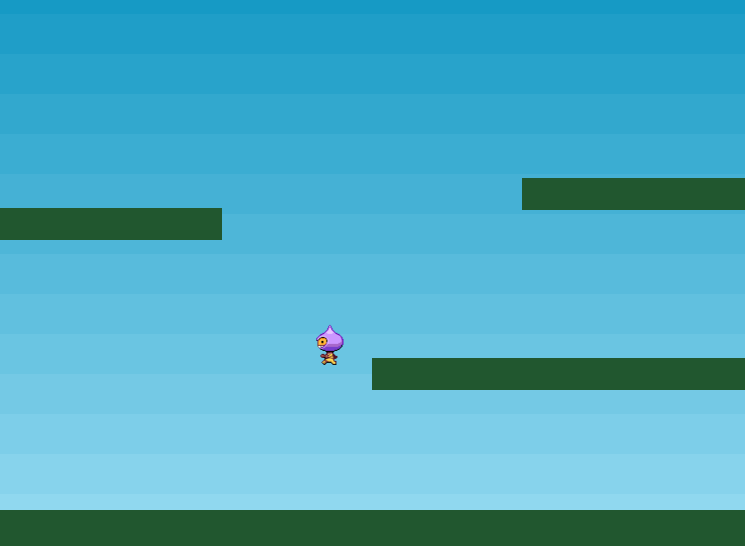
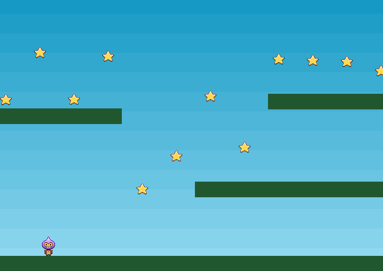
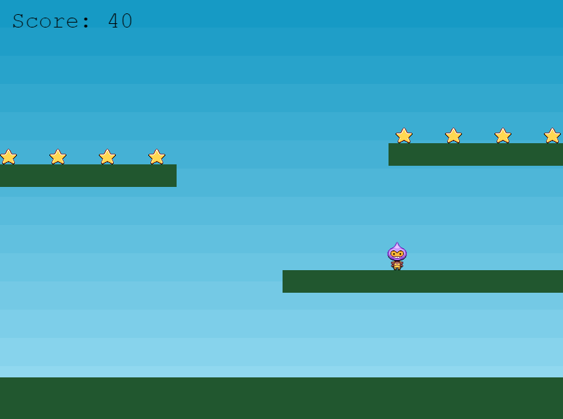
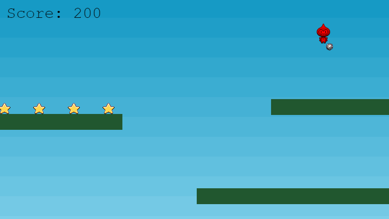

# PhaserJS



PhaserJS 란 HTML 기반 웹 게임을 만드는 것에 특화된 JS 프레임워크 이다.

가장 중요한 것은 웹 서버를 만들어야 하는데 HTML 코드로 이루어졌다면서 왜 웹서버를 만들어야 할까?

그 이유는 게임상에서 유출되면 안될 여러가지 리소스들을 무방비한 상태로 배포하는 것을 막기 위함이다.

여러가지 웹 서버들 중에서 NodeJS 를 사용하겠다.

## 설치

```javascript
yarn add phaser
```

server.js

```javascript
// @ts-nocheck
const http = require('http');
const fs = require('fs');
http.createServer((req, res) => {
	res.writeHead(200, { 'Content-Type': 'text/html' });
	fs.readFile(__dirname + '/index.html', (err, data) => {
		res.end(data, 'utf-8');
	});
}).listen(3000);
```

index.html

```html
<!DOCTYPE html>
<html>
	<head>
		<script src="https://cdn.jsdelivr.net/npm/phaser@3.15.1/dist/phaser-arcade-physics.min.js"></script>
	</head>
	<body>
		<script>
			var config = {
				type: Phaser.AUTO,
				width: 800,
				height: 600,
				physics: {
					default: 'arcade',
					arcade: {
						gravity: { y: 200 }
					}
				},
				scene: {
					preload: preload,
					create: create
				}
			};

			var game = new Phaser.Game(config);

			function preload() {
				this.load.setBaseURL('http://labs.phaser.io');

				this.load.image('sky', 'assets/skies/space3.png');
				this.load.image('logo', 'assets/sprites/phaser3-logo.png');
				this.load.image('red', 'assets/particles/red.png');
			}

			function create() {
				this.add.image(400, 300, 'sky');

				var particles = this.add.particles('red');

				var emitter = particles.createEmitter({
					speed: 100,
					scale: { start: 1, end: 0 },
					blendMode: 'ADD'
				});

				var logo = this.physics.add.image(400, 100, 'logo');

				logo.setVelocity(100, 200);
				logo.setBounce(1, 1);
				logo.setCollideWorldBounds(true);

				emitter.startFollow(logo);
			}
		</script>
	</body>
</html>
```


localhost:3000 으로 접속하였을 때 위와같은 화면이 나오면 성공이다.

## preload

PhaserJS 의 구조는 아래와 같은데 ,

```javascript
var config = {
	type: Phaser.AUTO,
	width: 800,
	height: 600,
	scene: {
		preload: preload,
		create: create,
		update: update
	}
};

// 800 * 600 의 화면을 만든다.

var game = new Phaser.Game(config);

// game 이란 변수에 해당 환경설정으로 초기화한 게임구조를 넣는다.

function preload() {
	this.load.image('sky', 'assets/sky.png');
	this.load.image('ground', 'assets/platform.png');
	this.load.image('star', 'assets/star.png');
	this.load.image('bomb', 'assets/bomb.png');
	this.load.spritesheet('dude', 'assets/dude.png', { frameWidth: 32, frameHeight: 48 });
}

// sky , ground , star, bomb , dude 등의 이미지를 해당 경로에서 다운로드 받아놓음
// 이는 create 함수에서 sky , ground , star ,bomb , dude 등으로 꺼내어 쓸 수 있음

function create() {
	this.add.image(400, 300, 'star');
}

// 실제 화면에 star 이미지를 400 * 300 의 크기로 출력함

function update() {}
```

그러므로 화면에 출력되는 것은 400 \* 300 사이즈의 star 이미지 이다.



https://phaser.io/tutorials/making-your-first-phaser-3-game/phaser3-tutorial-src.zip

위 이미지들을 받을 수 있는 공식 홈페이지 주소는 위와 같다

```javascript
var config = {
	type: Phaser.AUTO,
	width: 800,
	height: 600,
	physics: {
		// physics 속성에 물리적인 값들을 넣을 수 있다.
		default: 'arcade',
		// arcade 속성을 기본값으로 설정
		arcade: {
			gravity: { y: 300 },
			// 중력을 y 좌표 기준 300 만큼 적용함
			debug: false
		}
	},
	scene: {
		preload: preload,
		create: create,
		update: update
	}
};

function create() {
	this.add.image(400, 300, 'sky');

	platforms = this.physics.add.staticGroup();
	// physics 값에 적용되는 그룹을 적용
	platforms.create(400, 568, 'ground').setScale(2).refreshBody();
	// ground 이미지 크기를 2배로 하며 배경이 바뀌어도 계속 재생되게함
	platforms.create(600, 400, 'ground');
	// 600 * 400 좌표에 ground 이미지 생성
	platforms.create(50, 250, 'ground');
	//  ..
	platforms.create(750, 220, 'ground');
	//  ..
}
```



실행결과는 위와 같다.

## 플레이어 생성

```javascript
player = this.physics.add.sprite(100, 450, 'dude');
// 플레이어는 100 , 450 좌표에 dude 란 이미지로 생성될 것임을 명시

player.setBounce(0.2);
// 점프 및 초기생성 위치에서 지면에 충돌할 때 자연스럽게 통통 튀기는 정도 0.2
player.setCollideWorldBounds(true);
// 벽을 뚫고 나갈 수 없음
this.anims.create({
	key: 'left',
	frames: this.anims.generateFrameNumbers('dude', { start: 0, end: 3 }),
	frameRate: 10,
	repeat: -1
});
// left 란 key 값이 주어질 때 dude 란 캐릭터의 이미지는 0번째 부터 3 번째까지 총 4개의 이미지를 사용할 것
// 프레임은 10 프레임을 사용하며
// 반복해서 0 부터 4 까지의 이미지를 동작
this.anims.create({
	key: 'turn',
	frames: [{ key: 'dude', frame: 4 }],
	frameRate: 20
});

this.anims.create({
	key: 'right',
	frames: this.anims.generateFrameNumbers('dude', { start: 5, end: 8 }),
	frameRate: 10,
	repeat: -1
});
```





실행화면은 위와 같다.

```javascript
this.physics.add.collider(player, platforms);
// 물리적인 환경에 충돌체로 캐릭터와 지면을 추가한다.
```



그렇게 한다면 위 사진처럼 캐릭터가 지면에 서있을 수 있게 된다.

## 플레이어 이동

```javascript
cursors = this.input.keyboard.createCursorKeys();
// 내가 누르는 키를 이벤트로 받을 수 있는 코드이다.
if (cursors.left.isDown) {
	// 좌측 키가 눌러져있는가?
	player.setVelocityX(-160);
	// 플레이어의 X 좌표를 -160 만큼 이동시킨다.
	player.anims.play('left', true);
	// 플레이어 동작 중 left 동작을 활성화 시킨다.
} else if (cursors.right.isDown) {
	player.setVelocityX(160);
	player.anims.play('right', true);
} else {
	player.setVelocityX(0);
	// 플레이어 좌표를 그대로 둔다
	player.anims.play('turn');
	// 플레이어 동작 turn 을 활성화시킨다.
}
if (cursors.up.isDown && player.body.touching.down) {
	// 키보드 상향 방향키를 눌렀으며 플레이어 신체가 바닥에 닿아있는가?
	player.setVelocityY(-330);
	// Y 좌표를 -330 만큼 이동시킨다.
}
```



해당 화면처럼 움직이기가 가능해진다.

## 별 수집하기

```javascript
stars = this.physics.add.group({
	// 별 이라는 변수를 물리그룹에 추가한다
	key: 'star',
	// 이미지는 star 이미지
	repeat: 11,
	// 처음 1개를 제외한 11개를 더 추가 총 12개
	setXY: { x: 12, y: 0, stepX: 70 }
	// 첫 star 의 위치는 12 , 0 그 이후부터는 82 , 0   152 , 0 ...
});

stars.children.iterate(function (child) {
	// 생성된 12 개의 자식컴포넌트 의 반복
	child.setBounceY(Phaser.Math.FloatBetween(0.4, 0.8));
	// 각각의 자식들은 0.4 ~ 0.8 까지의 반동을 갖는다.
});

this.physics.add.collider(player, platforms);
this.physics.add.collider(stars, platforms);
// star 가 지면을 뚫고 내려가지 않도록 방지

this.physics.add.overlap(player, stars, collectStar, null, this);
// 만약 플레이어 와 stars 가 겹쳤다면 collectStar 함수를 실행해라

function collectStar(player, star) {
	star.disableBody(true, true);
	// star 를 가려라
}
```



실행 화면은 위와 같다.

## 점수 획득

```javascript
var score = 0;
// 점수 0 으로 선언
var scoreText;
// 점수를 화면에 표시해줄 변수

scoreText = this.add.text(16, 16, 'score: 0', { fontSize: '32px', fill: '#000' });
// 화면상의 점수는 16 * 16 지점에 score:0 이라는 텍스트로 32px 의 폰트사이즈와 #000 의 컬러를 갖는다.

function collectStar(player, star) {
	// 위 쪽 별을 얻은경우
	star.disableBody(true, true);

	score += 10;
	// 점수에 10점을 더함
	scoreText.setText('Score: ' + score);
	// 화면상의 점수에 내 점수 대입
}
```



star 이미지를 4개 먹은 경우 결과화면

## 게임오버

```javascript
bombs = this.physics.add.group();
// group 에 bombs 를 추가함
this.physics.add.collider(bombs, platforms);
// 지면과 폭탄은 서로 통과할 수 없음을 명시
this.physics.add.collider(player, bombs, hitBomb, null, this);
// plyaer 와 bombs 가 접촉했을 경우 hitBomb 함수를 실행함
function hitBomb(player, bomb) {
	this.physics.pause();
	// 이 개체를 멈춤
	player.setTint(0xff0000);
	// 이 개체의 색을 빨강색으로 변경
	player.anims.play('turn');
	// 이 개체의 동작을 turn 으로 변경
	gameOver = true;
	// gameOver 변수를 참으로 변경
}
function collectStar(player, star) {
	star.disableBody(true, true);

	score += 10;
	scoreText.setText('Score: ' + score);

	if (stars.countActive(true) === 0) {
		// stars 개체의 수가 0 인 경우
		stars.children.iterate(function (child) {
			child.enableBody(true, child.x, 0, true, true);
		});

		var x = player.x < 400 ? Phaser.Math.Between(400, 800) : Phaser.Math.Between(0, 400);
		// 플레이어의 X 좌표에 따라 x 변수의 값을 변경
		var bomb = bombs.create(x, 16, 'bomb');
		// 폭탄을 x ,16 좌표에 bomb 이미지로 생성
		bomb.setBounce(1);
		// 반동은 1
		bomb.setCollideWorldBounds(true);
		// bomb 는 틀을 벗어날 수 없음
		bomb.setVelocity(Phaser.Math.Between(-200, 200), 20);
	}
}
```

별을 다 먹은경우 폭탄이 랜덤하게 튀기며 별은 다시생성 부딪힐 경우 정지하며 게임오버

실행 결과는 아래 사진과 같다.


