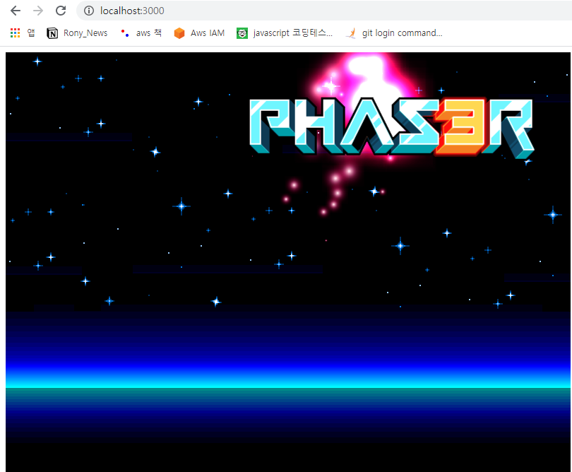

# PhaserJS


PhaserJS 란 HTML 기반 웹 게임을 만드는 것에 특화된 JS 프레임워크 이다.

가장 중요한 것은 웹 서버를 만들어야 하는데 HTML 코드로 이루어졌다면서 왜 웹서버를 만들어야 할까?

그 이유는 게임상에서 유출되면 안될 여러가지 리소스들을 무방비한 상태로 배포하는 것을 막기 위함이다.

여러가지 웹 서버들 중에서 NodeJS 를 사용하겠다.

## 설치

```javascript
yarn add phaser
```

server.js

```javascript
// @ts-nocheck
const http = require('http');
const fs = require('fs');
http.createServer((req, res) => {
	res.writeHead(200, { 'Content-Type': 'text/html' });
	fs.readFile(__dirname + '/index.html', (err, data) => {
		res.end(data, 'utf-8');
	});
}).listen(3000);
```

index.html

```html
<!DOCTYPE html>
<html>
	<head>
		<script src="https://cdn.jsdelivr.net/npm/phaser@3.15.1/dist/phaser-arcade-physics.min.js"></script>
	</head>
	<body>
		<script>
			var config = {
				type: Phaser.AUTO,
				width: 800,
				height: 600,
				physics: {
					default: 'arcade',
					arcade: {
						gravity: { y: 200 }
					}
				},
				scene: {
					preload: preload,
					create: create
				}
			};

			var game = new Phaser.Game(config);

			function preload() {
				this.load.setBaseURL('http://labs.phaser.io');

				this.load.image('sky', 'assets/skies/space3.png');
				this.load.image('logo', 'assets/sprites/phaser3-logo.png');
				this.load.image('red', 'assets/particles/red.png');
			}

			function create() {
				this.add.image(400, 300, 'sky');

				var particles = this.add.particles('red');

				var emitter = particles.createEmitter({
					speed: 100,
					scale: { start: 1, end: 0 },
					blendMode: 'ADD'
				});

				var logo = this.physics.add.image(400, 100, 'logo');

				logo.setVelocity(100, 200);
				logo.setBounce(1, 1);
				logo.setCollideWorldBounds(true);

				emitter.startFollow(logo);
			}
		</script>
	</body>
</html>
```



localhost:3000 으로 접속하였을 때 위와같은 화면이 나오면 성공이다.

## preload

PhaserJS 의 구조는 아래와 같은데 ,

```javascript
var config = {
	type: Phaser.AUTO,
	width: 800,
	height: 600,
	scene: {
		preload: preload,
		create: create,
		update: update
	}
};

// 800 * 600 의 화면을 만든다.

var game = new Phaser.Game(config);

// game 이란 변수에 해당 환경설정으로 초기화한 게임구조를 넣는다.

function preload() {
	this.load.image('sky', 'assets/sky.png');
	this.load.image('ground', 'assets/platform.png');
	this.load.image('star', 'assets/star.png');
	this.load.image('bomb', 'assets/bomb.png');
	this.load.spritesheet('dude', 'assets/dude.png', { frameWidth: 32, frameHeight: 48 });
}

// sky , ground , star, bomb , dude 등의 이미지를 해당 경로에서 다운로드 받아놓음
// 이는 create 함수에서 sky , ground , star ,bomb , dude 등으로 꺼내어 쓸 수 있음

function create() {
	this.add.image(400, 300, 'star');
}

// 실제 화면에 star 이미지를 400 * 300 의 크기로 출력함

function update() {}
```

그러므로 화면에 출력되는 것은 400 \* 300 사이즈의 star 이미지 이다.


https://phaser.io/tutorials/making-your-first-phaser-3-game/phaser3-tutorial-src.zip

위 이미지들을 받을 수 있는 공식 홈페이지 주소는 위와 같다

```javascript
var config = {
	type: Phaser.AUTO,
	width: 800,
	height: 600,
	physics: {
		// physics 속성에 물리적인 값들을 넣을 수 있다.
		default: 'arcade',
		// arcade 속성을 기본값으로 설정
		arcade: {
			gravity: { y: 300 },
			// 중력을 y 좌표 기준 300 만큼 적용함
			debug: false
		}
	},
	scene: {
		preload: preload,
		create: create,
		update: update
	}
};

function create() {
	this.add.image(400, 300, 'sky');

	platforms = this.physics.add.staticGroup();
	// physics 값에 적용되는 그룹을 적용
	platforms.create(400, 568, 'ground').setScale(2).refreshBody();
	// ground 이미지 크기를 2배로 하며 배경이 바뀌어도 계속 재생되게함
	platforms.create(600, 400, 'ground');
	// 600 * 400 좌표에 ground 이미지 생성
	platforms.create(50, 250, 'ground');
	//  ..
	platforms.create(750, 220, 'ground');
	//  ..
}
```


실행결과는 위와 같다.
